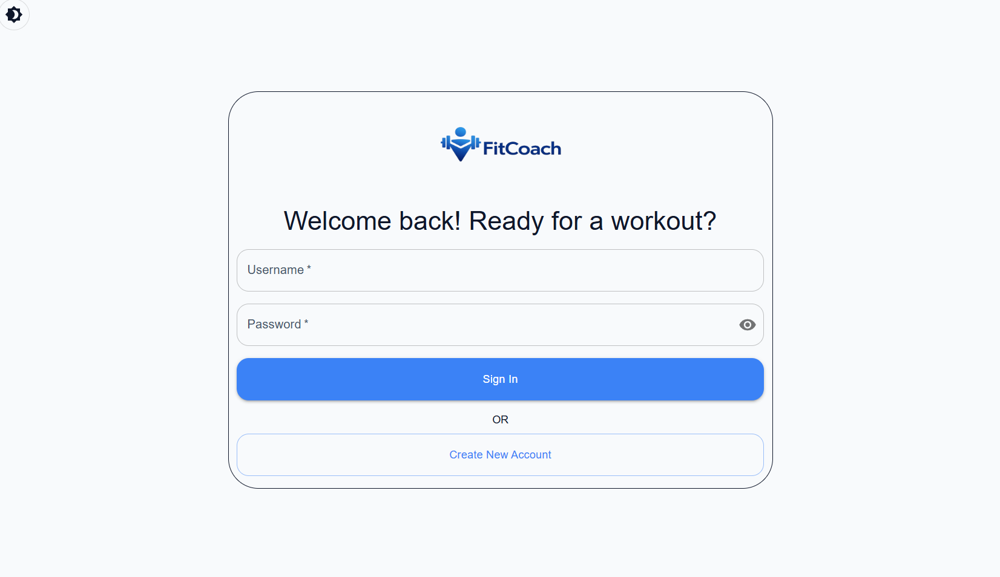
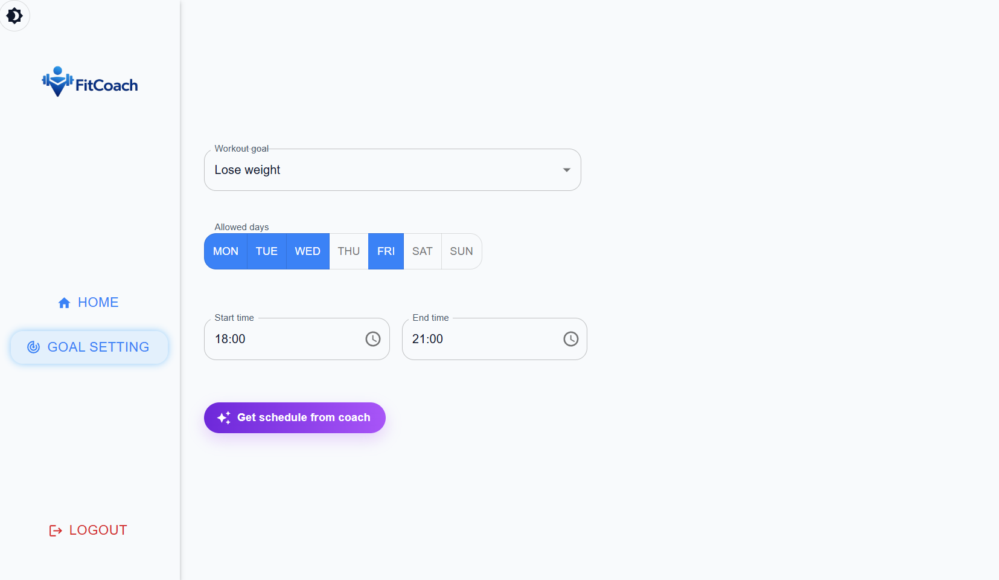
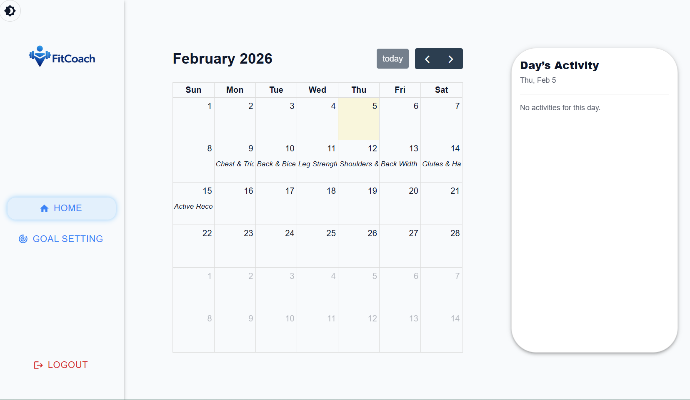
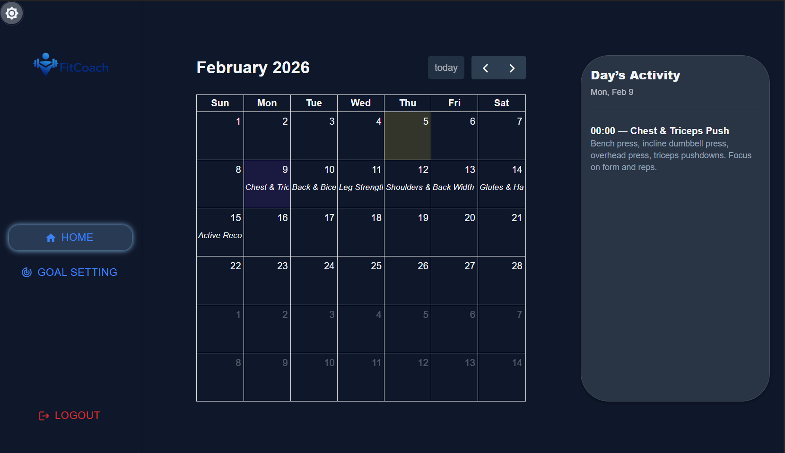

<p align="center">
  
</p>

<h1 align="center">FitCoach</h1>

<p align="center">
  Set your goal, pick your availability, and let a strict AI coach generate a workout schedule — then review everything day-by-day in a calendar.
</p>

<p align="center">
  <a href="#demo--screenshots">Demo / Screenshots</a> ·
  <a href="#features">Features</a> ·
  <a href="#tech-stack">Tech Stack</a> ·
  <a href="#getting-started">Getting Started</a>
</p>

## Demo / Screenshots

**Demo video:** [_YouTube Link_](https://youtu.be/kSCdCszyGCw)

### Screenshots






## Features

- **Login / Logout:** Sign in securely and keep your session protected.
- **Goal setup:** Choose your fitness goal from a simple dropdown.
- **Availability & time slots:** Select your workout days and the time windows you can train.
- **AI schedule generation (Gemini):** Generate a weekly workout plan based on your goal and availability.
- **Calendar view:** Browse your plan in a clean calendar layout.
- **Day details panel:** Click any date to see the workout details and description for that day.

## Tech Stack

### Frontend

- **React** (UI)
- **Vite** (dev server & build)
- **FullCalendar** (calendar UI)
- **MUI** (forms, dialogs, buttons)
- **Tailwind CSS** (layout & styling)

### Backend

- **Node.js + Express** (REST API)
- **PostgreSQL + Sequelize** (data persistence / ORM)
- **Gemini API** (AI schedule generation)

## Getting Started

### Prerequisites

This project currently runs **locally only** (no hosted backend yet).
To run it on your machine, you’ll need:

- **Node.js** (LTS recommended)
- **PostgreSQL** (local instance)
- **Gemini API key** (from Google AI Studio)

### Installation

Clone the repository, then install dependencies for both the client and server.

```bash
git clone <YOUR_REPO_URL>
cd <YOUR_REPO_NAME>
```

#### Install client dependencies

```bash
cd client
npm install
```

#### Install server dependencies

```bash
cd ../server
npm install
```

### Environment Variables

> ⚠️ Do not commit `.env` files. Keep API keys private.

#### Client (`/client/.env`)

Create a `.env` file inside the `client` folder:

```env
VITE_API_BASE_URL=http://localhost:3033
VITE_API_AI_BASE_URL=https://generativelanguage.googleapis.com/v1beta
VITE_API_API_KEY=your_gemini_api_key
```

- `VITE_API_BASE_URL`: Base URL of your local backend server.
- `VITE_API_AI_BASE_URL`: Gemini API base URL.
- `VITE_API_API_KEY`: Your Gemini API key. Create one in [Google AI Studio](https://aistudio.google.com/).

#### Server (`/server/.env`)

Create a `.env` file inside the `server` folder:

```env
DB_USERNAME=your_db_username
DB_PASSWORD=your_db_password
```

- `DB_USERNAME` / `DB_PASSWORD`: PostgreSQL credentials used by the server.

### Run Locally

You’ll need to run **both** the backend server and the frontend client.

#### 1) Start the backend

From the project root:

```bash
cd server
```

Start the server

```bash
node index.js
```

#### 2) Start the frontend

Open a new terminal, then from the project root:

```bash
cd client
npm run dev
```

#### Local URLs

- Frontend: `http://localhost:5173`
- Backend: `http://localhost:3033`

## Roadmap / Remaining Tasks

- [ ] **Edit scheduled events:** Update or reschedule existing workout activities from the calendar.
- [ ] **Log activity + progress tracking:** Mark workouts as done and track progress over time (e.g., charts / stats).
- [ ] **AI feedback:** Get personalized feedback based on your activity logs and consistency.
- [ ] **“Angry coach” mode:** If you skip a workout, the AI coach reacts accordingly 😡 (motivational reminders / roast-style feedback).

## Known Issues / Limitations

- **Demo configuration:** The AI prompt is currently set to generate **one activity per day** for **one week** only.
- **Single goal per user:** Each user can only have **one active goal** at the moment (multiple goals are not supported yet).

## Contributors / Team

**Development Team**

- Mattias Bygge
- Takamichi Oki
- Thanh Chu

## Project Context

Built as a team project for the Codeworks Thesis.

## License

MIT
